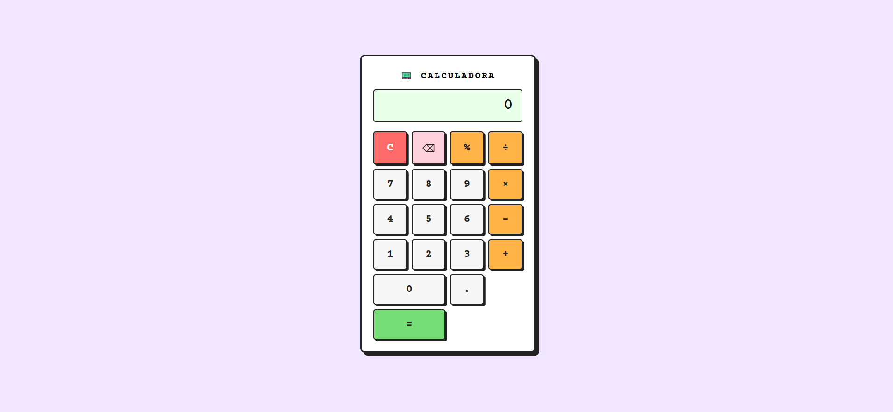

# 📟 Calculadora Web

Uma calculadora simples desenvolvida com HTML, CSS e JavaScript puro, com suporte a teclado e interface amigável.

---

## 🚀 Funcionalidades

- ➕ Operações básicas: soma, subtração, multiplicação e divisão  
- 🔢 Suporte a números decimais  
- ⚠️ Tratamento de erros  
- 📱 Layout responsivo simples  

---

## 🛠️ Tecnologias utilizadas

- HTML5  
- CSS3  
- JavaScript

---

## 📸 Preview do Projeto

  

[👉 Clique aqui para visualizar o projeto](https://goncalvezztech.github.io/BasicCalculator/)
